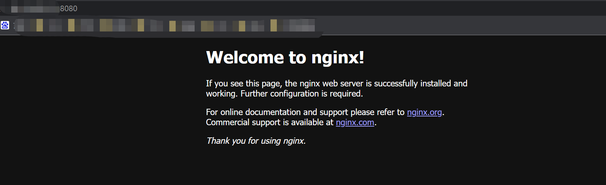

## Docker命令一文通

- [Docker命令一文通](#docker命令一文通)
  - [前言](#前言)
    - [类比Git](#类比git)
  - [命令练习](#命令练习)
    - [拉取镜像到本地](#拉取镜像到本地)
      - [search](#search)
      - [pull](#pull)
      - [images](#images)
      - [run：基础版](#run基础版)
      - [ps](#ps)
      - [logs](#logs)
      - [exec](#exec)
      - [cp](#cp)
    - [分割线](#分割线)
      - [stop](#stop)
      - [start](#start)
      - [rm](#rm)
      - [restart](#restart)
      - [run：高级版](#run高级版)
      - [rmi](#rmi)

### 前言

> 本文主要以帮助学习、理解Docker的命令。
> 
> 学习Docker命令之前，我认为有必要了解一下Docker的三个基本概念：镜像仓库、镜像、容器，知道这些概念之间的关系，会帮助你更好的理解和使用Docker命令。
> (ps：如果你对Git命令有一定了解，学习起来可能会很简单)
>
> - 镜像仓库：存放、管理各种各样不同的镜像。
> - 镜像：某位大牛构建（搭建）好的，含有特定功能的微型系统，类似于迷你版的`linux`。
> - 容器：以某个镜像为基础，启动运行后形成的一个可操作性系统。
> 
> [Github原文](https://github.com/DingDangDog/learn/tree/main/document/docker/Docker命令一文通.md)（`欢迎Stars`😘）

<!-- more -->

#### 类比Git

如果你是初学者，觉得不好理解解，可以尝试类比Git去理解。如果你还不知道Git，那就跳过在这吧。

- 镜像仓库：官方提供了一个DockerHub，可以类比GitHub。
- 镜像：类比远程仓库，固定的一份版本在那，不提交新版本变更之前，一直是不变的。
- 容器：类比本地仓库，你可以改很多东西，这个改动在你提交推送的远程仓库之前，对远程仓库没有任何影响。这里要注意的一点不同是，容器不是提交更新镜像，而是提交推送一个全新的镜像。

希望以上能够帮助你理解Docker的三大基本概念，接下来我们实际联系Docker的命令。


### 命令练习

> 接下来将以具体的测试实例为主线，按照命令的使用顺序一一列出并讲解。若有条件，建议学习者跟随文章一起，每个命令亲手试验，体会其作用和效果，这将会帮助你更好的理解它。
> 
> 练习场景：Docker运行Nginx

#### 拉取镜像到本地

##### search

- 命令作用：从镜像仓库中搜索指定的镜像。

```sh
docker search --limit 5 nginx

# 以下为输出结果
NAME                               DESCRIPTION                                     STARS     OFFICIAL   AUTOMATED
nginx                              Official build of Nginx.                        17429     [OK]       
bitnami/nginx                      Bitnami nginx Docker Image                      140                  [OK]
ubuntu/nginx                       Nginx, a high-performance reverse proxy & we…   61                   
bitnami/nginx-ingress-controller   Bitnami Docker Image for NGINX Ingress Contr…   20                   [OK]
kasmweb/nginx                      An Nginx image based off nginx:alpine and in…   2 
```

- 命令解析：
  - `docker`：固定开头，之后将不作说明
  - `search`：从镜像仓库中搜索镜像，默认的仓库地址是官方的`https://hub.docker.com/`
  - `--limit 5`：根据镜像STARS从多到少排序，查出前5个
  - `nginx`：搜索镜像名字为`nginx`的镜像
- 输出介绍：
  - `NAME`：镜像名称
  - `DESCRIPTION`：镜像描述
  - `STARS`：点赞数
  - `OFFICIAL`：官方认证
  - `AUTOMATED`：自动化

##### pull

- 命令作用：从镜像仓库中拉取指定镜像到本地

```sh
docker pull nginx

# 以下为输出结果
Using default tag: latest
latest: Pulling from library/nginx
31b3f1ad4ce1: Pull complete 
fd42b079d0f8: Pull complete 
30585fbbebc6: Pull complete 
18f4ffdd25f4: Pull complete 
9dc932c8fba2: Pull complete 
600c24b8ba39: Pull complete 
Digest: sha256:0b970013351304af46f322da1263516b188318682b2ab1091862497591189ff1
Status: Downloaded newer image for nginx:latest
docker.io/library/nginx:latest
```

- 命令解析：
  - `pull`：从镜像仓库中拉取镜像到本地
  - `nginx`：拉取镜像名为`nginx`的镜像，注意：不加版本号默认拉取版本号为`latest`的镜像，等同于加版本号的`nginx:latest`

##### images

- 命令作用：查看本地已有的Docker镜像

```sh
docker images -a

# 以下为输出结果
REPOSITORY         TAG       IMAGE ID       CREATED         SIZE
nginx              latest    2d389e545974   10 days ago     142MB
mereith/van-blog   latest    e4850f477e56   2 weeks ago     985MB
mongo              4.4.16    ef85efd58fca   3 weeks ago     438MB
hello-world        latest    feb5d9fea6a5   12 months ago   13.3kB
```

- 命令解析
  - `images`：查看本地已有的Docker镜像
  - `-a`：查看所有
- 输出介绍：
  - `REPOSITORY`：镜像名称，有些人也叫其为仓库
  - `TAG`：版本号
  - `IMAGE ID`：镜像唯一ID
  - `CREATED`：镜像构建时间
  - `SIZE`：镜像文件大小
- 拓展：`docker images -qa`：查看本地所有镜像的`IMAGE ID`

##### run：基础版

- 命令作用：运行指定Docker镜像

```sh
docker run -d nginx

# 以下为输出结果
b88611a9e606371157f715acebc1441547fc8aed0a7f61888104136da58c523d
```

- 命令解析
  - `run`：运行docker镜像
  - `-d`：后台运行

- 输出介绍：输出的是生成的Docker容器的ID全量

##### ps

- 命令作用：查看Docker容器

```sh
docker ps -a

# 以下为输出结果
CONTAINER ID   IMAGE                     COMMAND                  CREATED          STATUS                      PORTS                                                                      NAMES
b88611a9e606   nginx                     "/docker-entrypoint.…"   17 minutes ago   Up 17 minutes               80/tcp                                                                     exciting_lamport
3d399f493b24   nginx                     "/docker-entrypoint.…"   18 minutes ago   Exited (0) 17 minutes ago                                                                              silly_fermat
03b301b6bf8e   mereith/van-blog:latest   "sh entrypoint.sh"       12 days ago      Up 12 days                  0.0.0.0:80->80/tcp, :::80->80/tcp, 0.0.0.0:443->443/tcp, :::443->443/tcp   vanblog_vanblog_1
```

- 命令解析：
  - `ps`：查看docker容器
  - `-a`：查看全部容器，包括已经停止的。
- 输出介绍：
  - `CONTAINER ID`：容器ID
  - `IMAGE`：运行容器所用的镜像名称
  - `COMMAND`：最终执行命令
  - `CREATED`：创建时间
  - `STATUS`：容器当前状态
  - `PORTS`：容器端口使用情况
  - `NAMES`：容器名称

##### logs

- 命令作用：查看指定容器日志

```sh
docker logs -n 50 -f b88611a9e606

# 以下为输出结果
/docker-entrypoint.sh: /docker-entrypoint.d/ is not empty, will attempt to perform configuration
/docker-entrypoint.sh: Looking for shell scripts in /docker-entrypoint.d/
/docker-entrypoint.sh: Launching /docker-entrypoint.d/10-listen-on-ipv6-by-default.sh
10-listen-on-ipv6-by-default.sh: info: Getting the checksum of /etc/nginx/conf.d/default.conf
10-listen-on-ipv6-by-default.sh: info: Enabled listen on IPv6 in /etc/nginx/conf.d/default.conf
/docker-entrypoint.sh: Launching /docker-entrypoint.d/20-envsubst-on-templates.sh
/docker-entrypoint.sh: Launching /docker-entrypoint.d/30-tune-worker-processes.sh
/docker-entrypoint.sh: Configuration complete; ready for start up
2022/09/23 13:08:38 [notice] 1#1: using the "epoll" event method
2022/09/23 13:08:38 [notice] 1#1: nginx/1.23.1
2022/09/23 13:08:38 [notice] 1#1: built by gcc 10.2.1 20210110 (Debian 10.2.1-6) 
2022/09/23 13:08:38 [notice] 1#1: OS: Linux 3.10.0-1160.71.1.el7.x86_64
2022/09/23 13:08:38 [notice] 1#1: getrlimit(RLIMIT_NOFILE): 1048576:1048576
2022/09/23 13:08:38 [notice] 1#1: start worker processes
2022/09/23 13:08:38 [notice] 1#1: start worker process 31
```

- 命令解析
  - `logs`：查看docker容器日志
  - `-n 50`：最后50行
  - `-f`：查找
  - `b88611a9e606`：指定的的容器ID（`CONTAINER ID`），此处也可以使用容器名称（`NAMES`）

- 输出说明：输出指定容器的日志，此处即为Nginx容器的日志

##### exec

- 命令作用：进入指定容器

```sh
docker exec -it b88611a9e606 /bin/bash
```

- 命令解析
  - `exec`：进入容器
  - `-it`：以终端模式
  - `b88611a9e606`：容器ID（CONTAINER ID），也可以使用容器名称（NAMES）
  - `/bin/bash`：运行bash命令行，亦可简化为`bash`

- 拓展：使用以上`exec`命令后，即进入容器内部，一般可以运行简单的`shell`命令，如`ls`、`cd`等，这取决于当前容器拥有的功能，使用`exit`即可退出当前容器。此处应该可以体会到一些开头说的概念：``镜像类似于迷你版的linux``。

##### cp

- 命令作用：宿主机与容器内部互相拷贝文件

```sh
 docker cp b88611a9e606:/etc/nginx/conf.d /usr/local/nginx/
 
 # 拷贝容器b88611a9e606中的文件(夹)/etc/nginx/conf.d，到本地的/usr/local/nginx/文件夹下，反之亦可
```

- 命令解析：
  - `cp`：拷贝文件
  - `参数1`：源文件（夹）
  - `参数2`：目的文件（夹）
- 拓展：此命令实际场景用的不多，因为一遍都会配置本地与容器的文件映射，不需要手动拷贝，但仍有必要了解有此命令。


#### 分割线

---

从此处开始，将会尽量减少中文，建议大家自己动手去体会，重在实践！

---


##### stop

- 命令作用：停止指定的docker容器

```sh
 docker stop b88611a9e606
```

##### start

- 命令作用：启动指定的已经停止的docker容器

```sh
docker start 03b301b6bf8e
```

##### rm

- 命令作用：删除指定容器

```sh
docker rm b88611a9e606
```

- 注意：可以增加参数`-f` 强制删除容器，即`docker rm -f b88611a9e606`，正在运行的容器也会被停止并删除，不推荐使用。

##### restart

- 命令作用：重启指定docker容器

```sh
docker restart 7d5fc1f41bb8
```

##### run：高级版

- 命令作用：启动容器的同时，增加多个参数来起到不同效果

```sh
docker run -p 8080:80 --name nginx -v /etc/nginx/nginx.conf:/usr/local/nginx/nginx.conf -d nginx
```

- 参数说明
  - `-p 8080:80`：将本机8080端口映射到容器的80端口
  - `--name nginx`：将启动的容器起名字叫`nginx`
  - `-v [参数1]:[参数2]`：将容器内`参数1`的文件（夹）与本机的`参数2`的文件（夹）绑定
  - `-d`：后台启动
- 访问端口验证



##### rmi

- 命令作用：删除镜像

```sh
docker rmi nginx
# 删除nginx镜像，提示有容器引用该镜像（其实这个容器已经停止运行了，但是还是被判定为引用）
# Error response from daemon: conflict: unable to remove repository reference "nginx" (must force) - container f37bbc9e2501 is using its referenced image 2d389e545974

docker rm f37bbc9e2501
# 删除容器
# f37bbc9e2501

docker rmi nginx
# 再次删除镜像，以下为输出结果
Untagged: nginx:latest
Untagged: nginx@sha256:0b970013351304af46f322da1263516b188318682b2ab1091862497591189ff1
Deleted: sha256:2d389e545974d4a93ebdef09b650753a55f72d1ab4518d17a30c0e1b3e297444
Deleted: sha256:363202476290a0db2316a59ad55a204a29c38a3911e3446667cb701cc4198dc7
Deleted: sha256:2206f0339ff8e4bea401bd90d6dc4e7e709bc22428c1ae5f68f38c67386c7e7f
Deleted: sha256:d70edfab07872218e08147095350ca0ae6e2b6cc21c38468b95d00e9ae8325cc
Deleted: sha256:7b46b6757c9a5142df79b3310962da6c7dd41a49a5a51c938d44fdf574b5f8e3
Deleted: sha256:39a76abc4386c54429c626f7bc0e378eddf566dad18f6b8a2281e480a5cae071
Deleted: sha256:b45078e74ec97c5e600f6d5de8ce6254094fb3cb4dc5e1cc8335fb31664af66e
```

- 拓展：同样可以加参数`-f`强制删除镜像，即`docker rmi -f nginx`，但不推荐。


