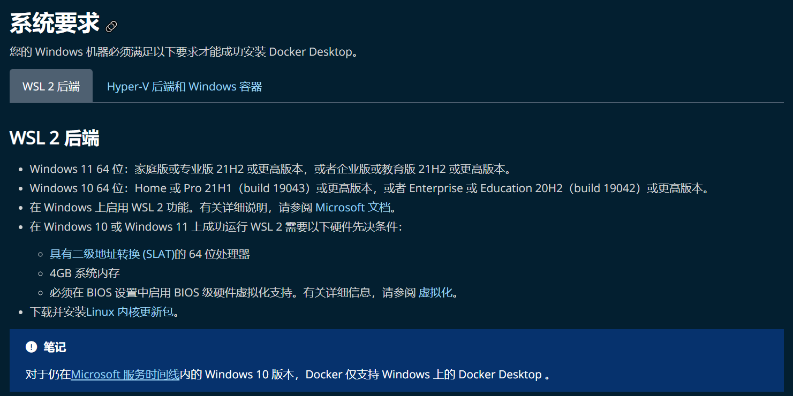

# Docker基础一文通

- [Docker基础一文通](#docker基础一文通)
  - [前言](#前言)
  - [前排提示](#前排提示)
  - [Docker常识](#docker常识)
  - [Docker安装](#docker安装)
    - [Linux](#linux)
    - [Windows](#windows)
  - [常用命令](#常用命令)
    - [启停命令](#启停命令)
      - [服务启动](#服务启动)
      - [服务停止](#服务停止)
      - [服务重启](#服务重启)
      - [服务状态查看](#服务状态查看)
    - [运维命令](#运维命令)
      - [查看已有镜像](#查看已有镜像)
      - [搜索镜像](#搜索镜像)
      - [拉取镜像](#拉取镜像)
      - [指定镜像启动容器](#指定镜像启动容器)
      - [删除镜像](#删除镜像)
      - [查看正在运行的镜像容器](#查看正在运行的镜像容器)
      - [查看服务日志](#查看服务日志)
      - [删除容器](#删除容器)


## 前言

>
> 市面上Docker的文档杂乱无章，本文以一文的形式，记录我使用Docker的经历，希望以实践经历为引，能帮助大家以最快的速度学会Docker的使用。
>
> Docker 从 17.03 版本之后分为 CE（Community Edition: 社区版） 和 EE（Enterprise Edition: 企业版），我们用社区版就可以了。
>
> 提示，如果想靠着一篇文章就精通Docker，那是不可能的。
> 
> [Github原文](https://github.com/DingDangDog/learn/tree/main/document/docker/Docker基础一文通.md)（`欢迎Stars`😘）


<!-- more -->

## 前排提示
> 本文为作者初学时接触的知识汇总，可能较为杂乱或存在一些问题，可能有一些更好的知识点整理文档供您阅读：
> - 《[Docker命令一文通](https://github.com/DingDangDog/learn/tree/main/document/docker/Docker命令一文通.md)》

## Docker常识

- 镜像：软件/程序打包后的文件；
- 容器：镜像启动后的实例，一个镜像可以启动多个容器；

## Docker安装

### Linux
> - 一键安装
> ```sh
> curl -sSL https://get.daocloud.io/docker | sh
> ```
> 安装完成后，即可执行命令验证
> ```sh
> docker version
> # 或
> docker info 
> ```
> 如未报错，且成功输出docker的client及server信息，说明安装成功。
>
> 若安装失败，请检查系统版本及各种环境，主要原因可能是系统版本过低，请升级系统或更换机器。
>
> 详情可参考：【[菜鸟教程：CentOS Docker 安装](https://www.runoob.com/docker/centos-docker-install.html)】

### Windows

>
>Windows安装Docker是安装Docker Desktop面板，其会自动安装Linux虚拟机和Docker容器，所以对系统版本要求较高。
>- 官方文档翻译：
>
>
>
>详情可参考：
>- [菜鸟教程：Windows Docker 安装](https://www.runoob.com/docker/windows-docker-install.html)
>- [官方文档：Install Docker Desktop on Windows](https://docs.docker.com/desktop/install/windows-install/)

## 常用命令

### 启停命令

> Docker服务的启停可以直接使用systemctl相关命令（`centos系统`），详情如下

#### 服务启动

```sh
systemctl start docker
```
#### 服务停止

```sh
systemctl stop docker
```
#### 服务重启

```sh
systemctl restart docker
```
#### 服务状态查看

```sh
systemctl status docker
```

### 运维命令

> 运维命令主要用于Docker内部服务的运维工作，所以命令大多数由Docker提供的。

#### 查看已有镜像

> ```sh
> docker images
> ```
> 输出：
> ```
> REPOSITORY         TAG       IMAGE ID       CREATED      SIZE
> mereith/van-blog   latest    e4850f477e56   2 days ago   985MB
> mongo              4.4.16    ef85efd58fca   9 days ago   438MB
> ```

#### 搜索镜像

> ```sh
> docker search --limit 5 hello-world
> ```
> 搜索镜像仓库中名为`hello-world`的镜像，可能有众多同名镜像，`--limit 5`表示显示前5个（根据Stars数）。
>
> 输出示例
> ```
> NAME                     DESCRIPTION                                     STARS     OFFICIAL   > AUTOMATED
> hello-world              Hello World! (an example of minimal Dockeriz…   1843      [OK]       
> rancher/hello-world                                                      4                    
> okteto/hello-world                                                       0                    
> tacc/hello-world                                                         0                    
> armswdev/c-hello-world   Simple hello-world C program on Alpine Linux…   0 
> ```

#### 拉取镜像

> ```sh
> docker pull hello-world:latest
> ```
> 拉取名为`mereith/van-blog`，版本为`latest`的镜像。

#### 指定镜像启动容器

> ```sh
> docker run hello-world:latest
> ```
> 自定义容器名称启动镜像
> ```sh
> docker run --name=hello hello-world:latest
> ```

#### 删除镜像

> ```sh
> docker rmi hello-world:latest
> ```
> 移除名为`mereith/van-blog`，版本为`latest`的镜像。
>
> 当某个镜像启动后，在不停止docker容器的情况下，即便该镜像的运行已经停止，也无法通过以上命令删掉，会报类似占用的错：`Error response from daemon: conflict: unable to remove repository reference "hello-world:latest" (must force) - container 2360a19aa46f is using its referenced image feb5d9fea6a5`，此时可以使用强制删除
> - 强制删除镜像
> ```sh
> docker rmi -f mereith/van-blog:latest
> ```
> - 拓展：删除全部镜像。尽量不要使用！！！
> ```sh
> docker rmi -f $(docker images -qa)
> ```
> docker images -qa：查询全部镜像的ID


#### 查看正在运行的镜像容器

> ```sh
> docker ps
> ```
> 输出：
> ```
> CONTAINER ID   IMAGE                     COMMAND                  CREATED        STATUS        PORTS                                                                      NAMES
> 03b301b6bf8e   mereith/van-blog:latest   "sh entrypoint.sh"       13 hours ago   Up 13 hours   0.0.0.0:80->80/tcp, :::80->80/tcp, 0.0.0.0:443->443/tcp, :::443->443/tcp   vanblog_vanblog_1
> 639eb6bd551e   mongo:4.4.16              "docker-entrypoint.s…"   13 hours ago   Up 13 hours   >0.0.0.0:27017->27017/tcp, :::27017->27017/tcp                              vanblog_mongo_1
> ```
> - CONTAINER ID：镜像运行容器ID，可用于启停、查看日志等
> - IMAGE：镜像名称及版本
> - CREATED：镜像初始化时长
> - STATUS：镜像状态及时长：可分为已启动、正在启动等
> - PORTS：相关端口及映射
> - NAMES：镜像服务名，亦唯一，可用于启停、查看日志等

#### 查看服务日志

> ```sh
> docker logs -n 50 -f vanblog_vanblog_1
> # 等效于
> docker logs --tail 50 -f vanblog_vanblog_1
> ```
> 作用：查看`vanblog_vanblog_1`镜像最后50行日志
> 其中`vanblog_vanblog_1`为上述```docker ps```查出的``NAMES``，也可以使用``CONTAINER ID``。


#### 删除容器
> 与删除镜像操作一致，只是把`rmi`改为`rm`即可。
> ```sh
> # 03b301b6bf8e为容器ID，也可以使用容器NAME
> docker rm 03b301b6bf8e
> ```