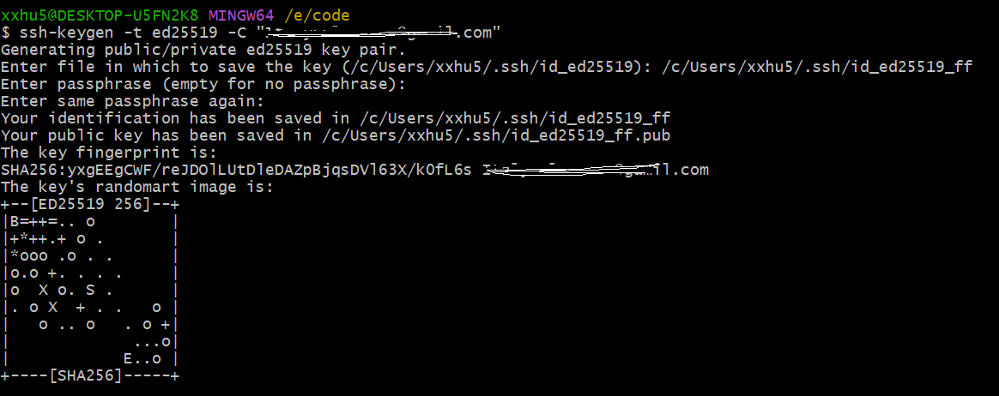
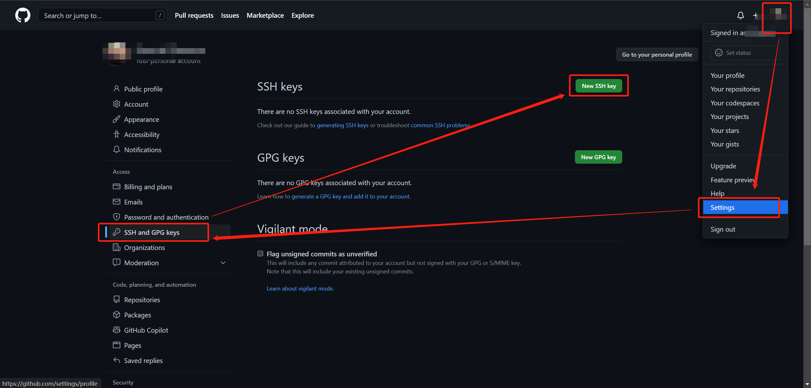
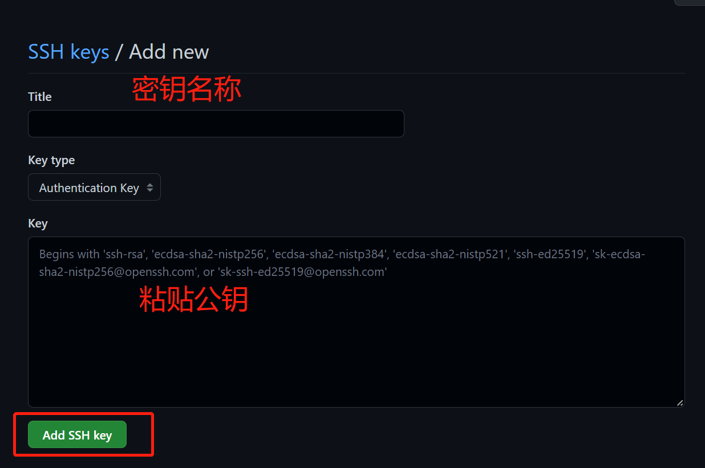
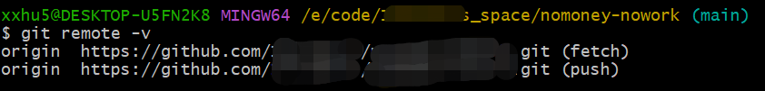
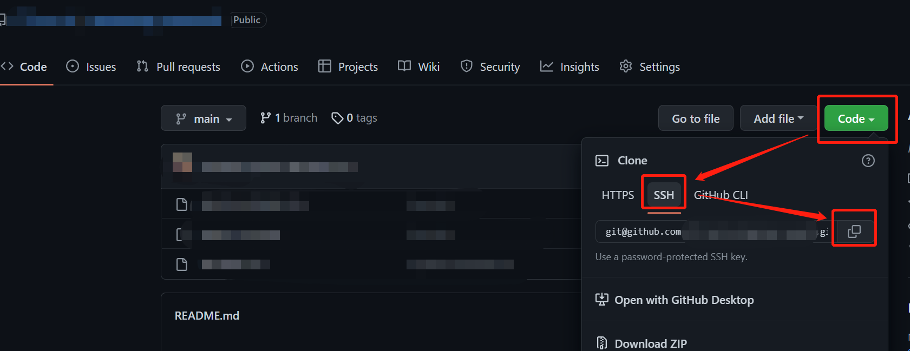

# GitHub使用SSH连接

## Windows 10

### 前提

学习本文，你应该拥有以下技能：

1. 了解Windows环境下`git bash`的基本使用。
2. 已经拥有`GitHub`帐号，并可以登录。

[Github原文](https://github.com/DingDangDog/learn/blob/main/document/git/GitHub%E9%85%8D%E7%BD%AESSH%E5%AF%86%E9%92%A5.md)（`欢迎Stars`😘）

### <a name="keygen">生成SSH密钥</a>

[官方文档](https://docs.github.com/cn/authentication/connecting-to-github-with-ssh/generating-a-new-ssh-key-and-adding-it-to-the-ssh-agent)

1. 运行 `Git Bash`

2. 运行以下命令生成ssh密钥`命令中 your_email@example.com 替换为你的邮箱地址`

```shell
ssh-keygen -t ed25519 -C "your_email@example.com"
```

> **注：**如果您使用的是不支持 Ed25519 算法的旧系统，请使用以下命令：
>
> ```shell
> ssh-keygen -t rsa -b 4096 -C "your_email@example.com"
> ```

3. 执行命令后，输入密钥信息：密钥存储路径和文件名（`文件名建议指定，路径建议默认即可`）、密码（`可忽略`）	

> 其中`/c/Users/xxhu5/.ssh/`为指定目录，`id_ed25519_ff`为指定文件名
>
> 

- 将刚创建好的密钥添加到ssh-agent

```shell
ssh-add ~/.ssh/id_ed25519_ff
```

### 将SSH密钥添加到账户

[官方文档](https://docs.github.com/cn/authentication/connecting-to-github-with-ssh/adding-a-new-ssh-key-to-your-github-account)

- 在`git bash`中运行以下命令，以复制指定公钥

```shell
clip < ~/.ssh/id_ed25519_ff.pub
```

- 找到GitHub配置页面

> 

- 设置密钥信息，完成添加

> 
>
> 点击Add后，会输入github密码确认，确认后即可完成添加。

###  <a name="addconfig">添加配置文件</a>
1. 进入特定文件夹。一般在**[生成SSH密钥](#keygen)**时，会自动在系统盘当前用户下创建`.ssh`文件夹，如我的文件地址：`C:\Users\xxhu5\.ssh\`
2. j进入文件夹后，打开`git bash`命令行界面
3. 运行`touch config`命令，创建`config`文件
4. 运行`vim config`命令，编辑`config`文件
5. 将以下内容复制到文件内，并修改其中的内容
> ```
> Host ff
> 	HostName github.com
> 	PreferredAuthentications publickey
> 	IdentityFile ~/.ssh/id_ed25519_ff
> ```
> - 文件内容说明：
> 	- `Host`：本地名称，可自定义【重要：后续运行Git相关命令时，需要使用】
> 	- `HostName`：真实地址，一般是固定的仓库地址，如`github.com`，`gitee.com`
> 	- `PreferredAuthentications`：密钥类型，一般默认`publickey`
> 	- `IdentityFile`：密钥文件地址，即通过**[生成SSH密钥](#keygen)**生成的文件
>


###  测试SSH连接

[官方文档](https://docs.github.com/cn/authentication/connecting-to-github-with-ssh/testing-your-ssh-connection)

- 进入本地仓库目录
- 打开`git bash`，执行如下

```shell
ssh -T git@ff
```

- 输出以下内容即表示成功

```
Hi DingDangDog! You've successfully authenticated, but GitHub does not provide shell access.
```


> 第一次连接可能会出现如下警告，输入`yes`即可连接。
>
> ```shell
> > The authenticity of host 'github.com (IP ADDRESS)' can't be established.
> > RSA key fingerprint is SHA256:nThbg6kXUpJWGl7E1IGOCspRomTxdCARLviKw6E5SY8.
> > Are you sure you want to continue connecting (yes/no)?
> ```
> 
> 若继续出现如下提示，请检查排查密钥配置是否正确。
>
> ```shell
> git@ff: Permission denied (publickey).
> ```

#### 提示

若运行`ssh -T git@ff`命令成功后，运行`git push`时仍然报错`Permission denied`（无权限），一般是由于远程仓库地址的问题，请检查本地仓库配置的远端地址是否正确。

常见错误地址：
- `https://github.com/DingDangDog/learn.git`：仍然是`Https`方式的地址
- `git@github.com:DingDangDog/learn.git`：以本文演示为例，`git@github.com`应替换为`git@ff`

> 如下图使用命令查看
>
> 
>
> 发现是`Https`的URL，切换为`git`
>
> 
> ```shell
>  git remote set-url origin git@ff:DingDangDog/learn.git
> ```


###  多用户密钥配置

如果在单用户时配置了`config`文件，那么在变更为多用户时，只需重复以上步骤，并在`config`中增加配置即可。

如果以前没有配置`config`文件，则回到【[添加配置文件](#addconfig)】

- config

> 在`config`文件中配置多个`Host`即可，如下
>
> ```
>Host ddd
> 	HostName github.com
> 	PreferredAuthentications publickey
> 	IdentityFile ~/.ssh/id_ed25519_ddd
> 
>Host ff
> 	HostName github.com
> 	PreferredAuthentications publickey
> 	IdentityFile ~/.ssh/id_ed25519_ff
> ```

- 命令

> 使用时，默认的Git远程仓库地址`git@github.com`应替换为`git@[Host]`

```sh
# 绑定本地，注意@后边是config文件中配置的Host
ssh -T git@ddd

# 切换指定仓库的地址为ssh方式，注意ddd为config文件中配置的Host
git remote set-url origin git@ddd:DingDangDog/learn.git

# 推送
git push
```


